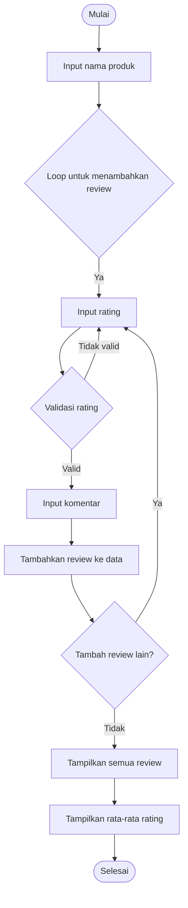

# Project-UAS
## Link URL Video

# Flowchart


# Struktur Utama Program

### 1. Class ```Data```

- Menyimpan data sebuah produk, termasuk nama produk dan daftar review terkait.
- Atribut:
  
    - ```product_name```: Nama produk.
    - ```reviews```: Daftar review (list).
### 2. Class ```Review```

- Menyimpan informasi sebuah review, yang terdiri dari rating dan komentar.
- Atribut:
   - ```rating```: Rating dari pengguna (angka antara 1-5).
   - ```comment```: Komentar dari pengguna.
### 3. Class ```Process```

- Berisi metode statis untuk memproses review dan data terkait. Metode yang disediakan adalah:
   - ```validate_rating(rating)```: Memastikan rating berada dalam rentang 1-5.
   - ```add_review(data, rating, comment)```: Menambahkan review ke dalam daftar review produk.
   - ```calculate_average_rating(data)```: Menghitung rata-rata rating dari semua review.
   - ```display_reviews(data)```: Menampilkan semua review yang telah ditambahkan.
   - ```display_average_rating(data)```: Menampilkan rata-rata rating untuk produk.

# Alur Program Utama

### 1. Input Nama Produk
- Pengguna diminta untuk memasukkan nama produk yang ingin mereka berikan review.
### 2. Menambahkan Review
- Pengguna diminta untuk memasukkan rating (dengan validasi bahwa nilai harus antara 1-5).
- Pengguna kemudian memasukkan komentar.
- Review yang valid ditambahkan ke daftar review produk.
### 3. Melakukan Iterasi
- Pengguna diberikan opsi untuk menambahkan review tambahan (loop).
### 4. Menampilkan Data
- Program menampilkan semua review yang sudah ditambahkan.
- Program juga menghitung dan menampilkan rata-rata rating produk.

# Fungsi-Fungsi Penting

- ```validate_rating(rating)```
    - Memastikan input rating valid (angka 1-5). Jika tidak valid, pengguna diberi pesan error.
- ```add_review(data, rating, comment)```
    - Membuat instance ```Review``` baru dengan rating dan komentar yang diberikan, lalu menambahkannya ke dalam atribut ```reviews``` dari instance ```Data```.
- ```calculate_average_rating(data)```
    - Menghitung rata-rata dari semua rating yang ada di dalam ```data.reviews```.
- ```display_reviews(data)```
    - Menampilkan semua review dalam format terstruktur.
- ```display_average_rating(data)```
    - Menampilkan rata-rata rating produk dalam format angka desimal dua digit.

# Contoh Penggunaan

### 1. Pengguna menjalankan program, memasukkan nama produk seperti "Laptop X".
### 2. Pengguna memasukkan review pertama: rating ```5``` dengan komentar "Produk sangat bagus!".
### 3. Pengguna memasukkan review kedua: rating ```3``` dengan komentar "Cukup baik, tapi ada kekurangan".
### 4. Program menampilkan:
  - Semua review yang telah ditambahkan.
  - Rata-rata rating produk, misalnya, ```4.00```.

Kode ini berguna untuk sistem manajemen ulasan sederhana, seperti yang dapat digunakan pada platform e-commerce kecil.

# Contoh Kode

```python
from data import Data
from review import Review

class Process:
    @staticmethod
    def validate_rating(rating):
        """Validasi input rating agar antara 1 hingga 5"""
        if rating < 1 or rating > 5:
            print("Rating harus antara 1 hingga 5.")
            return False
        return True
    
    @staticmethod
    def add_review(data, rating, comment):
        """Menambahkan review ke dalam data produk"""
        review = Review(rating, comment)
        data.reviews.append(review)

# Class untuk menyimpan data produk dan review
class Data:
    def __init__(self, product_name):
        self.product_name = product_name
        self.reviews = []

# Class untuk menyimpan review dari pengguna
class Review:
    def __init__(self, rating, comment):
        self.rating = rating
        self.comment = comment

# Class untuk memproses data dan review
class Process:
    @staticmethod
    def validate_rating(rating):
        """Validasi input rating agar antara 1 hingga 5"""
        if rating < 1 or rating > 5:
            print("Rating harus antara 1 hingga 5.")
            return False
        return True
    
    @staticmethod
    def add_review(data, rating, comment):
        """Menambahkan review ke dalam data produk"""
        review = Review(rating, comment)
        data.reviews.append(review)

    @staticmethod
    def calculate_average_rating(data):
        """Menghitung rata-rata rating dari semua review"""
        if len(data.reviews) == 0:
            return 0
        total_rating = sum(review.rating for review in data.reviews)
        return total_rating / len(data.reviews)
    
    @staticmethod
    def display_reviews(data):
        """Menampilkan semua review untuk produk"""
        if len(data.reviews) == 0:
            print("Tidak ada review untuk produk ini.")
        else:
            print(f"\nReview untuk produk: {data.product_name}")
            for idx, review in enumerate(data.reviews, start=1):
                print(f"Review {idx}:")
                print(f"Rating: {review.rating}")
                print(f"Komentar: {review.comment}")
                print("-" * 20)

    @staticmethod
    def display_average_rating(data):
        """Menampilkan rata-rata rating produk"""
        average = Process.calculate_average_rating(data)
        print(f"Rata-rata rating untuk produk {data.product_name}: {average:.2f}")

# Fungsi utama untuk menjalankan program
def main():
    print("Selamat datang di sistem review produk!")
    
    # Input nama produk
    product_name = input("Masukkan nama produk: ")
    data = Data(product_name)
    
    # Loop untuk menambahkan review
    while True:
        print("\nTulis review untuk produk ini:")
        
        # Input rating dengan validasi
        while True:
            try:
                rating = int(input("Masukkan rating (1-5): "))
                if Process.validate_rating(rating):
                    break
            except ValueError:
                print("Masukkan angka yang valid untuk rating.")
        
        # Input komentar
        comment = input("Masukkan komentar: ")
        
        # Menambahkan review
        Process.add_review(data, rating, comment)
        
        # Tanya apakah ingin menambah review lagi
        continue_review = input("Apakah Anda ingin menambah review lain? (y/n): ").lower()
        if continue_review != 'y':
            break
    
    # Menampilkan semua review
    Process.display_reviews(data)
    
    # Menampilkan rata-rata rating
    Process.display_average_rating(data)

# Menjalankan program
if __name__ == "__main__":
    main()
```


# Skenario Input:

### 1. Nama produk: "Laptop X"
### 2. Review 1:
- Rating: 5
- Komentar: "Produk sangat bagus!"
### 3. Review 2:
- Rating: 3
- Komentar: "Cukup baik, tapi ada kekurangan."
### 4. Pengguna berhenti menambahkan review.

# Contoh Output
```
Selamat datang di sistem review produk!
Masukkan nama produk: Laptop X

Tulis review untuk produk ini:
Masukkan rating (1-5): 5
Masukkan komentar: Produk sangat bagus!
Apakah Anda ingin menambah review lain? (y/n): y

Tulis review untuk produk ini:
Masukkan rating (1-5): 3
Masukkan komentar: Cukup baik, tapi ada kekurangan.
Apakah Anda ingin menambah review lain? (y/n): n

Review untuk produk: Laptop X
Review 1:
Rating: 5
Komentar: Produk sangat bagus!
--------------------
Review 2:
Rating: 3
Komentar: Cukup baik, tapi ada kekurangan.
--------------------
Rata-rata rating untuk produk Laptop X: 4.00
```

# Penjelasan Output:

### 1. Program menyambut pengguna dan meminta nama produk.
### 2. Pengguna menambahkan dua review dengan rating dan komentar.
### 3. Program menampilkan semua review yang telah ditambahkan dalam format terstruktur.
### 4. Program menghitung dan menampilkan rata-rata rating dari semua review.


